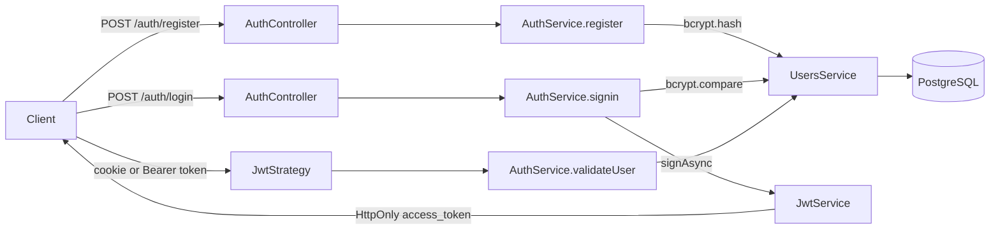

# BookGraph

> A NestJS API for a personal book archive, built around books, authors, tags, reading status, and discovery connections.


BookGraph is a NestJS API for a personal book archive. Its data model is being built around reading status, book ownership, authors, tags, and connections that describe how one book led to another.

The project is in active development. PostgreSQL persistence, TypeORM entities, an initial migration, seed data, Swagger documentation, scaffolded resource modules, and the first authentication flow are present. Authorization and the graph-facing API are still being built.

## Current implementation

### Domain model

The initial PostgreSQL schema contains:

- **Users** with UUID identifiers, unique usernames, roles (`ADMIN` or `USER`), and password hashes hidden from standard entity queries.
- **Books** with title, optional description, publication date, genre, cover URL, ISBN, and status (`read`, `reading`, or `wishlist`). Each book belongs to a user and an author.
- **Authors** with a name and optional biography.
- **Tags** owned by a user and linked to books through the `book_tags` join table.
- **Book connections** linking a source book to a discovered book, with an optional discovery method and suggester.

The schema uses UUID primary keys and foreign-key delete rules. Books cascade to their tags and connections when deleted; authors cannot be deleted while books still reference them.

### HTTP API

Swagger UI is mounted at `http://localhost:3000/api` by default.

The currently registered resource routes are scaffolded CRUD routes:

| Resource | Routes |
| --- | --- |
| Users | `POST /users`, `GET /users`, `GET /users/:id`, `PATCH /users/:id`, `DELETE /users/:id` |
| Tags | `POST /tags`, `GET /tags`, `GET /tags/:id`, `PATCH /tags/:id`, `DELETE /tags/:id` |
| Authors | `POST /author`, `GET /author`, `GET /author/:id`, `PATCH /author/:id`, `DELETE /author/:id` |
| Auth | `POST /auth/register`, `POST /auth/login` |

Most resource services still return placeholder responses rather than reading from or writing to the database. The book service has repository-backed `findAll`, `findOne`, and `remove` methods, but the `BookController` does not expose `/book` routes yet.

Incoming requests pass through a global `ValidationPipe` with transformation, whitelisting, and rejection of non-whitelisted properties. Authentication DTOs are validated; several scaffolded resource DTOs still need their request fields defined.

## Authentication 🔐

The current authentication scope covers registration and login. Authorization rules and protected business routes will be added during the remaining steps of point 3.

### Registration

`POST /auth/register` accepts a validated `AuthRegisterDto` containing:

```json
{
	"name": "Ada",
	"lastName": "Lovelace",
	"username": "ada",
	"password": "a-strong-password"
}
```

`AuthService` checks whether the username already exists, hashes the password with `bcrypt`, and delegates persistence to `UsersService`. The response excludes `hashedPassword`.

### Login

`POST /auth/login` accepts the username and password, compares the submitted password with the stored bcrypt hash, and signs a JWT with `JwtService` after successful authentication. The JWT is returned as an `HttpOnly` `access_token` cookie.

```json
{
	"username": "ada",
	"password": "a-strong-password"
}
```

The cookie is configured with `HttpOnly`, `SameSite=Lax`, a one-minute lifetime matching the current JWT expiry, and `Secure` in production. `cookie-parser` makes the cookie available to the JWT strategy.

### Current authentication flow



`JwtStrategy` can extract a token from the `access_token` cookie or from an `Authorization: Bearer <token>` header. The reusable `JwtAuthGuard` is available in `src/common/guards`, while applying it to domain routes and completing authorization are part of the remaining point 3 work.

## Technology

- NestJS 12, TypeScript, and Node.js
- PostgreSQL with TypeORM
- `@nestjs/jwt`, Passport, and `passport-jwt`
- `bcrypt` for password hashing
- `cookie-parser` for JWT cookie extraction
- Zod for `PORT` validation
- `class-validator` and `class-transformer` for Nest validation support
- Swagger / OpenAPI
- Vitest, Supertest, and `@vitest/coverage-v8`
- Oxlint and Prettier

## Getting started

### Prerequisites

- Node.js 20 or newer
- npm
- A running PostgreSQL instance
- The PostgreSQL `uuid-ossp` extension, required by the initial migration's `uuid_generate_v4()` defaults

### Install

```bash
npm install
```

Create a `.env` file in the project root. The application uses these database variables:

```dotenv
PORT=3000
DB_HOST=localhost
DB_PORT=5432
DB_USERNAME=<your-postgres-user>
DB_PASSWORD=<your-postgres-password>
DB_NAME=bookgraph
```

### Create the schema

Build before running TypeORM commands because the CLI loads compiled files from `dist/`:

```bash
npm run migration:run
```

To reset the development database with the sample dataset, run:

```bash
npm run seed
```

The seed command is destructive: it truncates the domain tables with `CASCADE`, then creates one admin user, five authors, five tags, ten books, six book-tag associations, and ten book connections.

### Run the API

```bash
# Development with file watching
npm run start:dev

# Production build and start
npm run build
npm run start:prod
```

The API listens on `http://localhost:3000` unless `PORT` is changed.

## Scripts

```bash
npm run build             # Compile the application
npm run start             # Start the compiled Nest application through Nest CLI
npm run start:dev         # Start in watch mode
npm run start:debug       # Start in debug/watch mode
npm run start:prod        # Run dist/main.js
npm run format            # Format source and test files
npm run lint              # Run Oxlint
npm test                  # Run unit tests
npm run test:watch        # Run Vitest in watch mode
npm run test:cov          # Run tests with coverage
npm run test:e2e          # Run the e2e Vitest configuration
npm run migration:run     # Apply compiled TypeORM migrations
npm run migration:revert  # Revert the latest migration
npm run migration:generate # Generate a migration after building
npm run seed              # Rebuild and replace database data with seed data
```

## Project structure

```text
src/
├── main.ts                    # Bootstrap, global validation, and Swagger
├── app.module.ts              # Root module and PostgreSQL/TypeORM setup
├── books/                     # Book module, service, entities, and join models
├── users/                     # User module, entity, DTOs, and scaffolded routes
├── author/                    # Author module, entity, DTOs, and scaffolded routes
├── tags/                      # Tag module, entity, DTOs, and scaffolded routes
├── common/guards/             # Reusable JWT guard
├── common/types/enums/        # User and book status enums
├── config/                    # TypeORM data source and Swagger/environment config
├── lib/database/seeds/        # Development database seed script
├── lib/schemas/               # Runtime environment schema
├── auth/                      # Registration, login, JWT service, and strategy
└── migrations/                # TypeORM migrations
test/                          # End-to-end tests
```

The `admin/` and `content/` directories are currently placeholders or unused development areas. There is no frontend application in this repository.

## Development status

Implemented foundation:

- NestJS application bootstrap and modular structure
- PostgreSQL and TypeORM configuration
- Initial relational schema and migration
- Book, user, author, tag, and graph-connection entities
- Development seed data
- Swagger route
- Global request validation configuration
- Password hashing and user registration flow
- JWT login with an `HttpOnly` cookie
- JWT strategy with cookie and Bearer token extraction
- Vitest unit/e2e test setup

Next implementation work includes:

- Complete DTOs and database-backed CRUD services
- Expose book and graph-connection endpoints
- Complete protected routes and authorization guards
- Add meaningful integration and e2e coverage
- Build the graph-oriented client experience

## License

This project is private and under active development. Licensing details will be added before a public release.
